# Caravan: Technical Specification

**Status:** Draft v0.2
**Date:** 2026-07-31
**Author:** watzon + assistant

---

## 1. Vision

Caravan is an all-in-one, self-hosted media acquisition and library management system. One binary, one database, one storage root. It searches for movies and TV shows, manages a wanted list, fetches releases through torrents and Usenet with embedded engines (external clients optional), imports and renames files into a clean library, and hands playback off to whatever the user already likes: Jellyfin, DLNA clients, or a TV's own USB browser.

Caravan is explicitly **not** a media player. Playback is shelled out. Caravan owns everything upstream of "press play."

### 1.1 Problem statement

The current self-hosted media stack is a convoy of separate apps: Sonarr/Radarr (wanted lists and library), Prowlarr (indexers), qBittorrent/SABnzbd (downloads), Overseerr (discovery). Each has its own database, its own config, and a folder-path contract with every neighbor. In Docker this is compounded by remote path mappings and hardlink breakage across per-app volumes. The wiring breaks often, and when it breaks the failure is silent: downloads land in the wrong place, imports stall, libraries drift.

Caravan collapses the convoy into a single vehicle.

### 1.2 Product pillars

1. **One process.** Search, wanted list, indexers, download engine, import, metadata, and playback handoff all live in one binary with one sqlite database.
2. **Filesystem is the source of truth.** The library is plain files in clean, Jellyfin-convention folders. The database is a rebuildable cache. A corrupted or deleted DB costs a rescan, never the media.
3. **One path model.** Every path in the DB is stored relative to a configurable **storage root**. Deployment mode is just a choice of root.
4. **Absorb the ecosystem, don't fight it.** Speak Torznab/Newznab to indexers, NFO + Jellyfin folder conventions to players, and qBittorrent/SABnzbd/NZBGet APIs to external download clients. Users keep their indexers, seedboxes, and players.
5. **Brutal scope.** Movies and TV only. No music, books, anime-specific numbering, or custom formats in v1.

---

## 2. Deployment modes

Caravan is one binary with three deployment targets. The only difference is where the storage root points and how the process is launched.

### 2.1 Mode A: Docker Compose (server-hosted)

Single container. One `/config` volume, one `/data` volume. Because downloads and library share one mount namespace, atomic moves and hardlinks work by construction, eliminating the number-one Docker *arr pain point.

```yaml
services:
  caravan:
    image: caravan:latest
    build:
      context: .
    ports:
      - "8677:8677"
    volumes:
      - ./config:/config
      - /mnt/media:/data
    environment:
      CARAVAN_DATA_DIR: /config
    restart: unless-stopped
```

The checked-in Compose file mounts `./data` at `/data` and seeds that path as
the storage root. Change it in the web UI when you need a different root (see
§10).

### 2.2 Mode B: Bare binary

```
caravan serve
```

Single static binary per OS (Windows, macOS, Linux; amd64 + arm64). No runtime dependencies. sqlite is linked via a pure-Go driver (modernc.org/sqlite) so cross-compilation needs no CGO. On Unix the bootstrap config defaults to `${XDG_CONFIG_HOME:-$HOME/.config}/caravan/caravan.yaml`, while the database and persistent process state default to `${XDG_DATA_HOME:-$HOME/.local/share}/caravan`. `--config` and `--data-dir` override those locations. The media storage root remains a separate first-run choice.

### 2.3 Mode C: Portable disk (the origin story)

The entire system lives on an external drive. Plug it into a computer, run the launcher for that OS, and the web UI comes up on localhost. Unplug it, plug it into a TV's USB port, and the TV browses the library as plain mass storage. No server runs in TV mode; that is the point.

```
caravan prepare /Volumes/MediaDrive
```

`prepare` scaffolds the drive:

```
/MediaDrive
  Start-Mac.command          # double-clickable launcher
  Start-Windows.bat
  Start-Linux.sh
  caravan/
    bin/
      darwin-arm64/caravan
      darwin-amd64/caravan
      windows-amd64/caravan.exe
      linux-amd64/caravan
      linux-arm64/caravan
    caravan.yaml             # drive-relative data_dir + storage_root
    data/                    # caravan.db, SQLite sidecars, marker, restore state
  incomplete/                # active downloads
  library/
    Movies/
    TV/
```

Behavior of `prepare`:

1. Detect the drive's filesystem; warn if not exFAT (see §3).
2. Create the layout above.
3. Copy the current binary into the matching `bin/` slot and fetch the other OS builds from the release artifact (or copy from a local directory if offline).
4. Write `caravan.yaml` with **drive-relative** data and storage roots and `portable: true`. `--data-dir` and `--storage-root` choose them; defaults are `caravan/data` and the drive root (`.`).
5. Write the three launchers.

Launchers resolve their own directory, pick the binary for the current OS/arch, and exec it with `--config` pointing at the on-disk config. All paths resolve relative to the binary location; the drive can mount at any letter or mountpoint.

**Portable-mode integrity rules** (exFAT has no journal, so this is the existential risk):

- The UI has a prominent **Shut down safely** button. It stops the download engine, runs `PRAGMA wal_checkpoint(TRUNCATE)`, closes the DB, flushes, and exits. Launchers then prompt the user to eject.
- On startup, caravan checks a clean-shutdown marker kept in a `caravan.state` sidecar file next to the database — not a row inside it, since the DB is a deletable cache (§7) and a flag deleted with it could never report a dirty eject. After a dirty shutdown it offers a filesystem check (`fsck.exfat` / `chkdsk`, printed for the user to run — caravan never runs fsck itself) and a `POST /system/verify` (`PRAGMA integrity_check` + library rescan) before resuming downloads.
- Seeding is paused by default in portable mode; a drive that may be unplugged should not have open file handles it cannot protect.

### 2.4 Mode comparison

| Concern | Docker | Binary | Portable disk |
|---|---|---|---|
| App data | `/config` | XDG data directory or `--data-dir` | Drive-relative, chosen by `prepare` |
| Storage root | `/data` (UI-configurable) | User-chosen path | Drive root, relative |
| Download engine | Embedded torrent + external clients | Same | Embedded torrent; seeding paused by default |
| Playback handoff | Jellyfin API + DLNA | Same | DLNA when running; TV USB browser when not |
| DB risk profile | Normal | Normal | Dirty-eject hardening (§2.3) |
| Target user | Home server | Tinkerer | Travel / TV-attached |

---

## 3. Filesystem and hardware guidance (portable mode)

Verified constraints, from the spec research:

- **exFAT is the only viable drive filesystem.** Native read/write on Windows 11, macOS, and Linux (in-tree since kernel 5.7). NTFS is read-only on macOS; UDF hard-disk RW is unreliable. Volume limit is ~128 PB and file size 16 EB per Microsoft's exFAT spec; the "2 TB limit" people cite is the MBR partition table, not exFAT.
- **Drives over 2 TiB must be GPT-partitioned.** Some older TVs only read MBR; check the TV manual.
- **TV filesystem support is model-dependent.** Sony: FAT32/exFAT/NTFS. LG: FAT32/NTFS broadly, exFAT on newer models. Samsung: model-dependent. exFAT is the right default; FAT32 is the fallback for ancient sets (4 GB file cap).
- **exFAT has no journal.** Unsafe eject is the top corruption risk. The §2.3 integrity rules are mandatory, not optional.
- **Recommend an SSD.** Samsung rates standard TV USB ports at 5V/0.5A (some models have a 5V/1A "USB HDD" port). Bus-powered mechanical HDDs are unreliable on TV ports; SSD in an enclosure, powered hub as fallback.

---

## 4. Tech stack

| Layer | Choice | Rationale |
|---|---|---|
| Language | Go | Static cross-compiled binaries are the entire ballgame for portable mode |
| Database | SQLite via modernc.org/sqlite + Bun | Pure Go/no CGO, WAL-mode single-file state, typed SQL-first ORM, embedded migrations |
| Web UI | Svelte SPA (Vite build), embedded via `go:embed` | Zero-install UI, smallest bundle inside the binary |
| Torrent engine | anacrolix/torrent | Mature, in-process, Go-native |
| UPnP/DLNA | huin/goupnp + custom DMS | SSDP advertise + content directory for TV/network clients |
| Remux/transcode | External ffmpeg (optional, detected at runtime) | Convert-for-TV queue; absent ffmpeg degrades gracefully |
| Metadata | TMDB (primary), TVDB (optional secondary) | Free API keys, permissive for this use |
| Config | YAML file + UI-managed settings table | File for bootstrap, DB for runtime settings |

---

## 5. Architecture

```mermaid
flowchart LR
    UI[Web UI SPA] --> API[REST API /api/v1]
    API --> LIB[Library & Metadata]
    API --> WANT[Wanted & Search]
    API --> DL[Download Manager]
    API --> IMP[Import Pipeline]
    API --> OUT[Playback Handoff]
    WANT --> IDX[Indexer Clients: Torznab/Newznab]
    WANT --> PARSE[Release Parser & Quality Profiles]
    DL --> TOR[Embedded Torrent Engine]
    DL --> EXT[External Clients: qBit / SAB / NZBGet]
    IMP --> FS[(Library filesystem: source of truth)]
    LIB --> FS
    OUT --> JELLY[Jellyfin API scan trigger]
    OUT --> DLNA[DLNA server]
    OUT --> NFO[NFO writers]
    API --> DB[(sqlite: rebuildable cache)]
```



### 5.1 Modules

**Library & Metadata.** Movies and series model. Matching against TMDB/TVDB. Library scan reconciles DB with filesystem (the rescan that makes the DB disposable). Season/episode model, monitored/unmonitored flags.

**Wanted & Search.** The wanted list (movies, series, seasons, episodes), automatic backlog search, RSS sync from indexers, and interactive search with a release picker. Interactive picker is a first-class screen, not a debug tool: it is the graceful degradation path when automatic parsing is uncertain.

**Calendar.** One combined calendar for episode air dates and movie release dates (digital/physical) — a single view where Sonarr and Radarr each need their own. Entries are status-colored with the same vocabulary as everywhere else (downloaded, downloading, missing, unaired). Month and agenda views, plus an iCal feed (`/calendar.ics`) for external calendar apps.

**Release Parser & Quality Profiles.** Scene-name parsing (title, year, season/episode, quality, source, codec, group, PROPER/REPACK). Quality ladder with upgrade-until-cutoff per item. Scope explicitly excludes anime absolute numbering and custom formats in v1.

**Indexer Clients.** Newznab/Torznab implementations plus a fail-closed local tracker-definition engine. Caravan invokes local definitions in process for its own searches and exposes each stored local indexer as an authenticated Torznab feed at `/api/v1/indexers/{id}/feed`; it never calls its own HTTP listener internally. Definition sources are namespaced (`builtin:id`, `user:id`) and first compile into inert capability manifests; only fully supported manifests enter the executable registry. Owner-supplied files are read from `<application-data>/indexer-definitions` with rooted file, size, and symlink checks. They may be explicitly configured through the API when executable but are not automatically advertised in the catalog. Only Caravan-authored definitions that pass schema, security, synthetic, canonical-suite, and real stored-feed verification appear there. The current Prowlarr/Jackett definition pack is not bundled because no compatible redistribution grant has been established.

**Download Manager.** Queue, priorities, categories, seeding limits. Engine interface:

> **Planned — torrent controls & insight (design gate first).** The v1 queue is deliberately minimal: progress, pause/resume, remove. A later iteration gives the embedded engine the controls users expect from a standalone client — global and per-torrent rate limits, seeding targets (ratio and time), connection/port settings — and per-download insight: peer and tracker lists, per-peer rates, availability. Needs a UI/UX design pass before implementation (queue detail drawer vs. dedicated download page); tracked in PLAN phase 3.

```go
type Engine interface {
    Add(ctx context.Context, r Release, opts AddOpts) (DownloadID, error)
    Status(ctx context.Context, id DownloadID) (Status, error)
    Remove(ctx context.Context, id DownloadID, deleteData bool) error
    // ...
}
```

Implementations: embedded torrent (default), qBittorrent API, SABnzbd API, NZBGet API, and embedded Usenet (native NNTP/yEnc/par2, phase 7). The embedded engines are the defaults for their protocols; external clients are explicitly optional bridges, never a requirement (§14).

**Import Pipeline.** Completed download → parse → match against wanted/library → rename per naming template → hardlink (same filesystem) or move → write NFO + poster → mark imported → trigger playback handoff. Hardlink preserves seeding; move used when linking is impossible. Failures surface as a visible "stuck imports" queue with manual match override, never silent drops.

**Playback Handoff.**

- **Jellyfin:** library layout follows Jellyfin naming conventions (§6), NFO files written alongside media, optional API call to trigger a library scan on import.
- **DLNA:** built-in DMS advertises the library on the LAN when the server is running. Covers smart TVs without unplugging the disk.
- **TV USB mode:** the library is plain folders; the TV's own browser handles it. Convert-for-TV queue (§9) exists to make files TV-safe before ejecting.

---

## 6. Library layout and naming

Jellyfin-compatible conventions, because the player ecosystem already parses them:

```
library/
  Movies/
    Big Buck Bunny (2008)/
      Big Buck Bunny (2008).mp4
      Big Buck Bunny (2008).nfo
      poster.jpg
  TV/
    Planet Earth II (2016)/
      Season 01/
        Planet Earth II (2016) - S01E01 - Islands.mkv
      tvshow.nfo
      poster.jpg
```

Naming templates are configurable but default to the above. In portable/TV-USB mode this doubles as the TV browser experience: folders read like a shelf.

---

## 7. Data model (sqlite)

Everything path-like is relative to the storage root.

| Table | Purpose |
|---|---|
| `settings` | Runtime config: storage root, quality defaults, naming templates, TV profile |
| `movies` / `series` / `seasons` / `episodes` | Library + wanted items, TMDB/TVDB IDs, monitored flags, profile ID |
| `quality_profiles` | Quality ladder, cutoff, per-item assignment |
| `indexers` | Configured Torznab/Newznab sources + direct sources |
| `releases` | Parsed search results, including bounded extended Torznab attributes (cache of what was seen) |
| `grabs` | History: which release was grabbed for which item and why |
| `downloads` | Active/historical downloads: engine, engine ID, state, paths |
| `download_clients` | External engine configs (host, credentials ref) |
| `media_files` | Imported files: relative path, size, quality, codec probe data |
| `events` | Audit/history feed for the UI |
| `jobs` | Durable job queue (searches, imports, conversions, scans) |

Recovery contract: `media_files`, `movies`, `series` are reconstructable from a library rescan + metadata providers. `grabs`/`events` are history and may be lost without functional damage.

**Persistence and migrations.** Store operations use private Bun database models so the SQL representation stays separate from the domain model; SQLite-specific operational and reporting queries may remain explicit SQL. Goose's embedded, sequential, forward-only SQL migrations run at startup and record each version in the same transaction as its schema changes. The disposable-cache pillar makes a botched upgrade survivable (worst case: delete DB, rescan), but migrations are the normal path — never "delete and rescan" as a release strategy.

**Job queue semantics.** `jobs` is a durable at-least-once queue: a worker claims a job with a lease, failures retry with exponential backoff, and expired leases are reclaimed at startup after a crash. Consequently every job type (search, import, conversion, scan) must be idempotent.

**Model edge cases (decided for v1):**

- **Multi-episode files** (`S01E01E02`): one `media_files` row linked to N episodes through a join table.
- **Specials:** Season 00, following TMDB/Jellyfin convention.
- **Movie editions** ("Director's Cut", "Extended"): parsed into a free-text edition field and rendered into the filename Jellyfin-style; no per-edition duplicate handling in v1.
- **Monitored semantics:** series, seasons, and episodes each carry their own flag. Setting the flag at a higher level cascades down as a bulk update, not a lock — individual children can still be toggled afterward.

---

## 8. TV compatibility and the Convert-for-TV queue

No transcoding exists in TV-USB mode, so compatibility is an acquisition-time concern.

- **TV profile setting:** describes the target set. Safe common denominator: H.264 8-bit + AAC-LC in MP4, up to 1080p. Capable sets: HEVC Main10, AV1, AC3. DTS is unsupported on current Samsung sets and flaky elsewhere; flag DTS audio in the picker.
- **Release scoring:** parser tags codec/container/audio; the quality profile can prefer or penalize releases incompatible with the active TV profile.
- **Convert-for-TV queue:** optional ffmpeg-backed jobs. Remux (container swap, stream copy) takes seconds and is tried first; full transcode is the explicit, slow fallback. Queue is exposed in the UI with a "run before eject" affordance in portable mode.
- Portable mode's shutdown flow can warn: "N files in the library are not TV-compatible."

---

## 9. Search flow

1. User searches in the UI (TMDB-backed, posters and metadata) or browses trending.
2. "Add to library" creates the wanted item with a quality profile and monitored scope (movie, whole series, selected seasons).
3. Automatic path: backlog search + RSS sync across enabled indexers → releases parsed → scored against profile → best candidate grabbed → sent to the default engine.
4. Interactive path: per-item "Search" shows the parsed, scored release table; user picks; grab proceeds identically.
5. On completion, the import pipeline takes over (§5.1).

Upgrade logic: when a monitored item has a file below its cutoff, it stays wanted; a better release replaces the file on import.

---

## 10. Configuration

Bootstrap config (`caravan.yaml`): application data directory, listen address/port (default `8677`), storage root seed, portable flag, and log level. Everything else lives in the `settings` table and is UI-managed. `data_dir` controls the database and process state; it is not the media storage root. The legacy `config_dir` key and `CARAVAN_CONFIG_DIR` environment variable remain deprecated aliases for `data_dir` and `CARAVAN_DATA_DIR`.

**Changing the storage root** (the server-hosted requirement): settings screen offers two operations:

1. **Re-point:** change the root, leave files in place (paths are relative, so this is instant and safe).
2. **Migrate:** caravan moves the library and incomplete directories to the new root itself, with a progress job and rollback-on-failure.

Disk-to-server migration is therefore: copy or move the drive contents, re-point the root, rescan. No export/import ceremony.

### 10.1 First run

Four light steps across two screens, then the scan review. The administrator account is created on the first screen; storage, metadata and the optional scan are configured on the second. Everything else ships with defaults; there is no further wizard.

1. **Administrator account.** Create the first administrator username and password (at least 8 characters). The account is required before setup can finish; `POST /setup/admin` creates it once and signs that browser in with an HttpOnly session cookie.
2. **Storage root.** Pick the storage root (pre-filled: `/data` in Docker, the drive root in portable mode).
3. **Metadata.** Enter a TMDB API key and, optionally, a TheTVDB v4 key (with a subscriber PIN when the subscription is user-supported). Each typed credential is proved before it is stored — `POST /settings/metadata/test` runs one live check and answers `{"status":"ok"}` or the provider's own reason — so an invalid key is caught in the field it was typed into rather than by the first add that fails. Leaving a field blank skips that provider: scanning still parses and imports, but nothing matches against it until a key is entered in Settings → Metadata.
4. **Optional scan.** Point Caravan at existing media; a library scan is queued immediately.
5. **Scan review.** Confidently matched items land in the library; everything else parks in an unmatched queue showing the parser's best guess, with manual metadata search to resolve.
The first run contains no adult-content references at all: with no adult library there is nothing to be invisible, and creating one is its own act inside Settings → Libraries (§10.2).

**Credential health.** `GET /system/status` reports `metadata_credential` as `absent`, `invalid` or `ok`, from a cached verdict rather than a live call — the status endpoint is polled on a timer and must cost no upstream traffic. The verdict changes only when the user does something: the Test button, a key edit (one live check, skipped when the Test button already proved that exact key), or a metadata call that comes back rejected. An unreachable provider is not a wrong key and never flips the state.

**Guarded surfaces.** Every screen that needs metadata — Add Movie/Series, search, Discover — answers a stable error code (`metadata_credential_absent` / `metadata_credential_invalid`) instead of a raw upstream failure, and the SPA renders the fix rather than an error toast: "Add your TMDB API key in Settings → Metadata" for an admin, and who to ask for a member, since a member cannot open that screen. A scan without a key still walks, parses and imports; the unmatched queue explains why nothing matched. The recurring metadata refresh has no error code because it has no caller to answer: with no key it skips the sweep rather than burning the recurring job's retries on ordinary first-run state, and per-title provider failures are logged. Reporting a credential-shaped failure on the Tasks screen waits on the queue rescheduling a recurring job that fails terminally, which it does not do today.

### 10.2 Restricting a library

Every library carries two switches of its own, and between them they are the whole access rule (`core.LibraryVisible`).

**Active** is the master switch. `PATCH /libraries/{id} {"active": false}` makes a library dormant for EVERYONE, an administrator included: its rows leave every screen, its root is not scanned, its automation is dropped and its DLNA container disappears. It deletes nothing — the rows, the files and the grants all wait for it to come back on — and it is how an owner hides a shelf from themselves. Because it binds the person who set it, the management surface is exempt: `GET /libraries` still lists a dormant library (carrying `active: false`, for the Inactive badge), and its PATCH, its indexer matrix and its access card still answer. A shelf that vanished from the only list its toggle lives on would be a one-way door.

**Restricted** narrows a library to the accounts named on it, plus administrators. `GET /libraries/{id}/access` answers `{"restricted": …, "users": [{"id", "username", "role", "always_granted", "granted"}]}`; `PUT` takes `{"restricted": …, "user_ids": […]}` and replaces the whole decision in one transaction. There is no per-user toggle and no `restricted` field on PATCH, deliberately: restricting a library and naming who keeps it are one decision, and split across two writes there is a window in which the library is restricted to nobody. `always_granted` marks the administrators — they bypass restriction, so a checkbox beside their name would describe a permission that does nothing. Administrators bypass it for a load-bearing reason as well as a customary one: the API key and an account-less install both authenticate as an administrator with user id 0, which can hold no grant, so binding administrators would lock both out of every restricted library with no door left to grant themselves through.

Restricting also clears `dlna_visible`, in the same write. DLNA has no accounts, so "restricted to two people" and "advertised to every device on the LAN" cannot both be true, and of the two it is the restriction that was just asked for. Unrestricting does not put the flag back: re-sharing is a second, deliberate act on the Reach card.

**Adult content** is a library, not a module. It is off because no adult library exists, and it is turned on by creating one: `POST /libraries {"kind": "adult", …}`, which is born restricted and DLNA-dark so the household does not acquire a shelf because somebody made one. The stash-box instance routes live behind the adult gate (`/adult/stashbox-instances`), which is absent while no adult library is visible — so the library necessarily comes first and its endpoint second. Creating one therefore proves no credential: the screen warns when no endpoint is configured, and a library whose chain resolves to no box parks its scans rather than failing them. Endpoints are plural (§4): the first instance an install ever creates takes the bare provider id `stashbox`, whichever door it came in through, and every one after it takes `stashbox:<slug>` — which is why a new adult library's default chain of `stashbox` alone resolves the moment its first endpoint is added.

Deleting an adult library is an ordinary deletion under the ordinary guards: it must be empty and must not be its kind's default. `active: false` is the non-destructive "off", and `GET /auth/me` reports `adult: true` exactly when the caller can see at least one active adult-kind library, alongside a member-safe `libraries` projection (`id`, `kind`, `name`) of everything else they may see.

---

## 11. API surface (REST, `/api/v1`)

Resource-oriented, consumed by the embedded SPA. Outline:

```
GET/PUT   /settings
POST      /settings/metadata/test   # live TMDB key check (body: api_key, or the stored one)
GET       /system/status            # mode, storage root, engine health, metadata credential health, dirty flag
POST      /system/shutdown          # safe shutdown (portable mode)
POST      /system/verify            # dirty-eject recovery: integrity check + rescan, clears the dirty flag
GET/POST  /library/movies           # list / add
GET/POST  /library/series
POST      /library/rescan
GET       /search?q=                # metadata search
GET       /calendar?start=&end=     # combined movie/episode calendar
GET       /calendar.ics             # iCal feed (API-key auth)
GET       /library/movies/{id}/releases   # interactive release picker
POST      /library/movies/{id}/grab       # (same pair on /library/series/{id} with ?season=&episode=)
GET/POST  /indexers                 # config; POST /indexers/{id}/test
GET       /indexers/catalog         # add-indexer directory (kind=torrent|usenet|generic)
POST      /indexers/categories      # caps category tree for the settings picker (body: url/type/api_key)
GET       /downloads                # queue; POST /downloads/{id}/pause|resume
DELETE    /downloads/{id}?deleteData=true|false
GET/POST  /import/queue             # stuck imports + manual match
GET/POST  /profiles/quality
GET/POST  /handoff/jellyfin         # config + test + scan trigger
GET/POST  /convert                  # Convert-for-TV queue
GET       /events                   # activity feed
```

Auth: single-user. Password optional, session cookie, API key for external tools. Portable mode binds `127.0.0.1` by default; Docker mode binds all interfaces and nags until a password is set.

**Upgrade from a no-password install.** On first boot after forced authentication is enabled, an existing installation with no users reports `needs_setup: true` and routes the browser to First run. The administrator step must be completed before storage and metadata setup can finish; existing installations that already have users keep their accounts and do not enter this flow.

---

## 12. Security notes

- No outbound connections except metadata providers, configured indexers, and the download engines.
- Indexer and client credentials stored in the DB, never in `caravan.yaml` comments or logs.
- The embedded torrent engine binds only the configured port; DHT/PEX configurable. Legal exposure is the user's; Caravan ships with no indexers preconfigured.
- Unsigned binaries on Windows will trip SmartScreen in portable mode; document first-run steps, consider code signing post-MVP.

---

## 13. Failure modes and integrity

| Failure | Behavior |
|---|---|
| Dirty eject (portable) | Startup detects it, offers fsck + rescan, downloads resume only after DB verifies |
| DB deleted/corrupt | Library rescan + metadata re-fetch rebuilds the cache; history lost, media intact |
| Partial download on disk | Engine resumes; `incomplete/` is separate from `library/` so the TV never sees partials |
| Import match failure | Item parks in the stuck-import queue with parsed guess; user resolves |
| ffmpeg missing | Convert-for-TV hidden; TV-incompatible warning degrades to informational |
| Engine unreachable (external client) | Queue pauses with health banner; embedded engine unaffected |

---

## 14. Phases

Development is organized into phases, each absorbing one hat of the existing ecosystem and each ending with something usable and testable on its own. The bare-binary mode is the development target from day one; Docker and portable packaging are hardened in phase 5. Detailed task breakdowns and acceptance criteria live in `docs/PLAN.md`.

| Phase | Ecosystem hat | Deliverable |
|---|---|---|
| 1 — Library manager | Library half of Sonarr/Radarr (tinyMediaManager/FileBot) | Scan existing media, TMDB match, rename to Jellyfin conventions, NFO/poster writing, library UI, rebuildable DB |
| 2 — Search & download | Prowlarr + qBittorrent | Indexer config → interactive search → grab → embedded torrent → auto-import into library |
| 3 — Automation | The Sonarr/Radarr brain | Wanted list, quality profiles, RSS + backlog search, automatic grab, upgrade-until-cutoff, stuck-import queue, combined calendar |
| 4 — Playback handoff | — | Jellyfin scan trigger, DLNA server, TV profiles, Convert-for-TV queue |
| 5 — Deployment | — (Caravan's differentiator) | Docker image + compose, `prepare` command, launchers, portable dirty-eject integrity flow |
| 6 — External clients | Download-client bridges | qBittorrent, SABnzbd, NZBGet engine implementations |
| 7 — Embedded Usenet | SABnzbd/NZBGet natively | NNTP client, NZB/yEnc pipeline, par2 repair, extraction — standalone Usenet with no external client |

The v1.1 interlude shipped **discover & requests** (TMDB explore, request
queue, and minimum availability) and **multi-user RBAC** (accounts, roles, and
request ownership). These are current shipped scope, not post-v1 candidates.

Post-v1 candidates: custom formats, anime numbering, music (Lidarr-shaped),
mobile app.

---

## 15. Testing strategy

- **Release parser:** table-driven corpus of real-world scene names versioned in-repo; every parser bug fix adds a corpus entry. Sonarr/Radarr behavior is the reference, but their GPL code and fixtures are not copied.
- **Import pipeline:** integration tests against temp directories covering hardlink vs move, cross-device fallback, name collisions, and a simulated no-hardlink filesystem (the exFAT case).
- **Indexer + metadata clients:** tested against recorded HTTP fixtures — no live API calls in CI. A fake Torznab server backs search/grab flow tests.
- **End-to-end smoke:** launch the real binary against a scratch directory and drive the REST API through a scripted scenario (add movie → fake indexer → fake download data → verify final library layout). Runs on Linux, macOS, and Windows in CI.
- **Cross-compilation:** CI builds every release target on every commit so portability never regresses silently.

---

## 16. Non-goals (v1)

- Media playback or transcoding-on-serve. Players are external.
- Music, books, comics, anime-specific numbering.
- Custom formats (Sonarr-style scoring DSL).
- User-defined approval policies beyond the shipped request flow.
- Acting as an indexer or tracker.

---

## 17. Open questions

1. Whether `prepare` should also offer to reformat a drive to exFAT+GPT (destructive; default no, require explicit flag).
2. DLNA transcoding: explicitly out, but DLNA clients vary wildly in codec support; document recommended clients.
3. Seeding policy defaults in portable mode beyond "paused": auto-resume with a big warning, or manual only.

**Resolved:** UI framework → Svelte (bundle size inside `go:embed`). Backlog discovery → RSS polling (simpler, universal across indexers).
