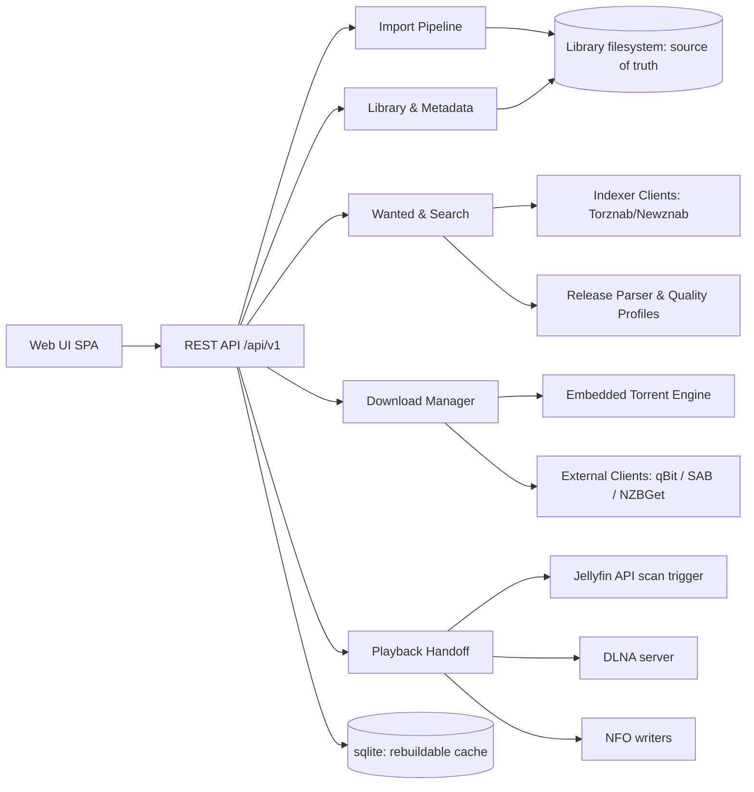

# Caravan: Technical Specification

**Status:** Draft v0.2
**Date:** 2026-07-31
**Author:** watzon + assistant

---

## 1. Vision

Caravan is an all-in-one, self-hosted media acquisition and library management system. One binary, one database, one storage root. It searches for movies and TV shows, manages a wanted list, fetches releases through torrents (embedded) and Usenet (external clients), imports and renames files into a clean library, and hands playback off to whatever the user already likes: Jellyfin, DLNA clients, or a TV's own USB browser.

Caravan is explicitly **not** a media player. Playback is shelled out. Caravan owns everything upstream of "press play."

### 1.1 Problem statement

The current self-hosted media stack is a convoy of separate apps: Sonarr/Radarr (wanted lists and library), Prowlarr (indexers), qBittorrent/SABnzbd (downloads), Overseerr (discovery). Each has its own database, its own config, and a folder-path contract with every neighbor. In Docker this is compounded by remote path mappings and hardlink breakage across per-app volumes. The wiring breaks often, and when it breaks the failure is silent: downloads land in the wrong place, imports stall, libraries drift.

Caravan collapses the convoy into a single vehicle.

### 1.2 Product pillars

1. **One process.** Search, wanted list, indexers, download engine, import, metadata, and playback handoff all live in one binary with one sqlite database.
2. **Filesystem is the source of truth.** The library is plain files in clean, Jellyfin-convention folders. The database is a rebuildable cache. A corrupted or deleted DB costs a rescan, never the media.
3. **One path model.** Every path in the DB is stored relative to a configurable **storage root**. Deployment mode is just a choice of root.
4. **Absorb the ecosystem, don't fight it.** Speak Torznab/Newznab to indexers, NFO + Jellyfin folder conventions to players, and qBittorrent/SABnzbd/NZBGet APIs to external download clients. Users keep their indexers, seedboxes, and players.
5. **Brutal scope.** Movies and TV only. No music, books, anime-specific numbering, or custom formats in v1.

---

## 2. Deployment modes

Caravan is one binary with three deployment targets. The only difference is where the storage root points and how the process is launched.

### 2.1 Mode A: Docker Compose (server-hosted)

Single container. One `/config` volume, one `/data` volume. Because downloads and library share one mount namespace, atomic moves and hardlinks work by construction, eliminating the number-one Docker *arr pain point.

```yaml
services:
  caravan:
    image: caravan/caravan:latest
    ports:
      - "8677:8677"
    volumes:
      - ./config:/config
      - /mnt/media:/data
    environment:
      CARAVAN_CONFIG_DIR: /config
    restart: unless-stopped
```

Storage root (`/data`) is set in the web UI on first run and changeable later (see §10).

### 2.2 Mode B: Bare binary

```
caravan serve --config ./caravan.yaml
```

Single static binary per OS (Windows, macOS, Linux; amd64 + arm64). No runtime dependencies. sqlite is linked via a pure-Go driver (modernc.org/sqlite) so cross-compilation needs no CGO.

### 2.3 Mode C: Portable disk (the origin story)

The entire system lives on an external drive. Plug it into a computer, run the launcher for that OS, and the web UI comes up on localhost. Unplug it, plug it into a TV's USB port, and the TV browses the library as plain mass storage. No server runs in TV mode; that is the point.

```
caravan prepare /Volumes/MediaDrive
```

`prepare` scaffolds the drive:

```
/MediaDrive
  Start-Mac.command          # double-clickable launcher
  Start-Windows.bat
  Start-Linux.sh
  caravan/
    bin/
      darwin-arm64/caravan
      darwin-amd64/caravan
      windows-amd64/caravan.exe
      linux-amd64/caravan
      linux-arm64/caravan
    caravan.yaml             # storage root: relative to drive
    data/                    # caravan.db, logs, cache
  incomplete/                # active downloads
  library/
    Movies/
    TV/
```

Behavior of `prepare`:

1. Detect the drive's filesystem; warn if not exFAT (see §3).
2. Create the layout above.
3. Copy the current binary into the matching `bin/` slot and fetch the other OS builds from the release artifact (or copy from a local directory if offline).
4. Write `caravan.yaml` with a **drive-relative** storage root and `portable: true`.
5. Write the three launchers.

Launchers resolve their own directory, pick the binary for the current OS/arch, and exec it with `--config` pointing at the on-disk config. All paths resolve relative to the binary location; the drive can mount at any letter or mountpoint.

**Portable-mode integrity rules** (exFAT has no journal, so this is the existential risk):

- The UI has a prominent **Shut down safely** button. It stops the download engine, runs `PRAGMA wal_checkpoint(TRUNCATE)`, closes the DB, flushes, and exits. Launchers then prompt the user to eject.
- On startup, caravan checks a clean-shutdown flag in the DB and the sqlite WAL state. After a dirty shutdown it offers a filesystem check (`fsck.exfat` / `chkdsk`) and a library rescan before resuming downloads.
- Seeding is paused by default in portable mode; a drive that may be unplugged should not have open file handles it cannot protect.

### 2.4 Mode comparison

| Concern | Docker | Binary | Portable disk |
|---|---|---|---|
| Storage root | `/data` (UI-configurable) | User-chosen path | Drive root, relative |
| Download engine | Embedded torrent + external clients | Same | Embedded torrent; seeding paused by default |
| Playback handoff | Jellyfin API + DLNA | Same | DLNA when running; TV USB browser when not |
| DB risk profile | Normal | Normal | Dirty-eject hardening (§2.3) |
| Target user | Home server | Tinkerer | Travel / TV-attached |

---

## 3. Filesystem and hardware guidance (portable mode)

Verified constraints, from the spec research:

- **exFAT is the only viable drive filesystem.** Native read/write on Windows 11, macOS, and Linux (in-tree since kernel 5.7). NTFS is read-only on macOS; UDF hard-disk RW is unreliable. Volume limit is ~128 PB and file size 16 EB per Microsoft's exFAT spec; the "2 TB limit" people cite is the MBR partition table, not exFAT.
- **Drives over 2 TiB must be GPT-partitioned.** Some older TVs only read MBR; check the TV manual.
- **TV filesystem support is model-dependent.** Sony: FAT32/exFAT/NTFS. LG: FAT32/NTFS broadly, exFAT on newer models. Samsung: model-dependent. exFAT is the right default; FAT32 is the fallback for ancient sets (4 GB file cap).
- **exFAT has no journal.** Unsafe eject is the top corruption risk. The §2.3 integrity rules are mandatory, not optional.
- **Recommend an SSD.** Samsung rates standard TV USB ports at 5V/0.5A (some models have a 5V/1A "USB HDD" port). Bus-powered mechanical HDDs are unreliable on TV ports; SSD in an enclosure, powered hub as fallback.

---

## 4. Tech stack

| Layer | Choice | Rationale |
|---|---|---|
| Language | Go | Static cross-compiled binaries are the entire ballgame for portable mode |
| Database | sqlite via modernc.org/sqlite | Pure Go, no CGO, WAL mode, single-file state |
| Web UI | Svelte SPA (Vite build), embedded via `go:embed` | Zero-install UI, smallest bundle inside the binary |
| Torrent engine | anacrolix/torrent | Mature, in-process, Go-native |
| UPnP/DLNA | huin/goupnp + custom DMS | SSDP advertise + content directory for TV/network clients |
| Remux/transcode | External ffmpeg (optional, detected at runtime) | Convert-for-TV queue; absent ffmpeg degrades gracefully |
| Metadata | TMDB (primary), TVDB (optional secondary) | Free API keys, permissive for this use |
| Config | YAML file + UI-managed settings table | File for bootstrap, DB for runtime settings |

---

## 5. Architecture



### 5.1 Modules

**Library & Metadata.** Movies and series model. Matching against TMDB/TVDB. Library scan reconciles DB with filesystem (the rescan that makes the DB disposable). Season/episode model, monitored/unmonitored flags.

**Wanted & Search.** The wanted list (movies, series, seasons, episodes), automatic backlog search, RSS sync from indexers, and interactive search with a release picker. Interactive picker is a first-class screen, not a debug tool: it is the graceful degradation path when automatic parsing is uncertain.

**Calendar.** One combined calendar for episode air dates and movie release dates (digital/physical) — a single view where Sonarr and Radarr each need their own. Entries are status-colored with the same vocabulary as everywhere else (downloaded, downloading, missing, unaired). Month and agenda views, plus an iCal feed (`/calendar.ics`) for external calendar apps.

**Release Parser & Quality Profiles.** Scene-name parsing (title, year, season/episode, quality, source, codec, group, PROPER/REPACK). Quality ladder with upgrade-until-cutoff per item. Scope explicitly excludes anime absolute numbering and custom formats in v1.

**Indexer Clients.** Newznab/Torznab implementations. Prowlarr can be pointed at Caravan as a Torznab source feed, or indexers are configured directly. Pluggable direct sources (Internet Archive, yt-dlp-supported sites) behind the same interface.

**Download Manager.** Queue, priorities, categories, seeding limits. Engine interface:

```go
type Engine interface {
    Add(ctx context.Context, r Release, opts AddOpts) (DownloadID, error)
    Status(ctx context.Context, id DownloadID) (Status, error)
    Remove(ctx context.Context, id DownloadID, deleteData bool) error
    // ...
}
```

Implementations: embedded torrent (default), qBittorrent API, SABnzbd API, NZBGet API. Embedded Usenet (native yEnc/par2/NZB) is a post-v1 milestone (§14).

**Import Pipeline.** Completed download → parse → match against wanted/library → rename per naming template → hardlink (same filesystem) or move → write NFO + poster → mark imported → trigger playback handoff. Hardlink preserves seeding; move used when linking is impossible. Failures surface as a visible "stuck imports" queue with manual match override, never silent drops.

**Playback Handoff.**

- **Jellyfin:** library layout follows Jellyfin naming conventions (§6), NFO files written alongside media, optional API call to trigger a library scan on import.
- **DLNA:** built-in DMS advertises the library on the LAN when the server is running. Covers smart TVs without unplugging the disk.
- **TV USB mode:** the library is plain folders; the TV's own browser handles it. Convert-for-TV queue (§9) exists to make files TV-safe before ejecting.

---

## 6. Library layout and naming

Jellyfin-compatible conventions, because the player ecosystem already parses them:

```
library/
  Movies/
    Big Buck Bunny (2008)/
      Big Buck Bunny (2008).mp4
      Big Buck Bunny (2008).nfo
      poster.jpg
  TV/
    Planet Earth II (2016)/
      Season 01/
        Planet Earth II (2016) - S01E01 - Islands.mkv
      tvshow.nfo
      poster.jpg
```

Naming templates are configurable but default to the above. In portable/TV-USB mode this doubles as the TV browser experience: folders read like a shelf.

---

## 7. Data model (sqlite)

Everything path-like is relative to the storage root.

| Table | Purpose |
|---|---|
| `settings` | Runtime config: storage root, quality defaults, naming templates, TV profile |
| `movies` / `series` / `seasons` / `episodes` | Library + wanted items, TMDB/TVDB IDs, monitored flags, profile ID |
| `quality_profiles` | Quality ladder, cutoff, per-item assignment |
| `indexers` | Configured Torznab/Newznab sources + direct sources |
| `releases` | Parsed search results (cache of what was seen) |
| `grabs` | History: which release was grabbed for which item and why |
| `downloads` | Active/historical downloads: engine, engine ID, state, paths |
| `download_clients` | External engine configs (host, credentials ref) |
| `media_files` | Imported files: relative path, size, quality, codec probe data |
| `events` | Audit/history feed for the UI |
| `jobs` | Durable job queue (searches, imports, conversions, scans) |

Recovery contract: `media_files`, `movies`, `series` are reconstructable from a library rescan + metadata providers. `grabs`/`events` are history and may be lost without functional damage.

**Migrations.** Embedded, sequential, forward-only SQL migrations run at startup; the applied version is tracked in the DB. The disposable-cache pillar makes a botched upgrade survivable (worst case: delete DB, rescan), but migrations are the normal path — never "delete and rescan" as a release strategy.

**Job queue semantics.** `jobs` is a durable at-least-once queue: a worker claims a job with a lease, failures retry with exponential backoff, and expired leases are reclaimed at startup after a crash. Consequently every job type (search, import, conversion, scan) must be idempotent.

**Model edge cases (decided for v1):**

- **Multi-episode files** (`S01E01E02`): one `media_files` row linked to N episodes through a join table.
- **Specials:** Season 00, following TMDB/Jellyfin convention.
- **Movie editions** ("Director's Cut", "Extended"): parsed into a free-text edition field and rendered into the filename Jellyfin-style; no per-edition duplicate handling in v1.
- **Monitored semantics:** series, seasons, and episodes each carry their own flag. Setting the flag at a higher level cascades down as a bulk update, not a lock — individual children can still be toggled afterward.

---

## 8. TV compatibility and the Convert-for-TV queue

No transcoding exists in TV-USB mode, so compatibility is an acquisition-time concern.

- **TV profile setting:** describes the target set. Safe common denominator: H.264 8-bit + AAC-LC in MP4, up to 1080p. Capable sets: HEVC Main10, AV1, AC3. DTS is unsupported on current Samsung sets and flaky elsewhere; flag DTS audio in the picker.
- **Release scoring:** parser tags codec/container/audio; the quality profile can prefer or penalize releases incompatible with the active TV profile.
- **Convert-for-TV queue:** optional ffmpeg-backed jobs. Remux (container swap, stream copy) takes seconds and is tried first; full transcode is the explicit, slow fallback. Queue is exposed in the UI with a "run before eject" affordance in portable mode.
- Portable mode's shutdown flow can warn: "N files in the library are not TV-compatible."

---

## 9. Search flow

1. User searches in the UI (TMDB-backed, posters and metadata) or browses trending.
2. "Add to library" creates the wanted item with a quality profile and monitored scope (movie, whole series, selected seasons).
3. Automatic path: backlog search + RSS sync across enabled indexers → releases parsed → scored against profile → best candidate grabbed → sent to the default engine.
4. Interactive path: per-item "Search" shows the parsed, scored release table; user picks; grab proceeds identically.
5. On completion, the import pipeline takes over (§5.1).

Upgrade logic: when a monitored item has a file below its cutoff, it stays wanted; a better release replaces the file on import.

---

## 10. Configuration

Bootstrap config (`caravan.yaml`): config dir, listen address/port (default `8677`), storage root override, portable flag, log level. Everything else lives in the `settings` table and is UI-managed.

**Changing the storage root** (the server-hosted requirement): settings screen offers two operations:

1. **Re-point:** change the root, leave files in place (paths are relative, so this is instant and safe).
2. **Migrate:** caravan moves the library and incomplete directories to the new root itself, with a progress job and rollback-on-failure.

Disk-to-server migration is therefore: copy or move the drive contents, re-point the root, rescan. No export/import ceremony.

### 10.1 First run

1. Pick the storage root (pre-filled: `/data` in Docker, the drive root in portable mode).
2. Optionally point Caravan at existing media; a library scan is queued immediately.
3. Scan review screen: confidently matched items land in the library; everything else parks in an unmatched queue showing the parser's best guess, with manual metadata search to resolve.

Everything else ships with defaults; there is no further wizard.

---

## 11. API surface (REST, `/api/v1`)

Resource-oriented, consumed by the embedded SPA. Outline:

```
GET/PUT   /settings
GET       /system/status            # mode, storage root, engine health, dirty flag
POST      /system/shutdown          # safe shutdown (portable mode)
GET/POST  /library/movies           # list / add
GET/POST  /library/series
POST      /library/rescan
GET       /search?q=                # metadata search
GET       /calendar?start=&end=     # combined movie/episode calendar
GET       /calendar.ics             # iCal feed (API-key auth)
GET/POST  /wanted/{id}/releases     # interactive release picker
POST      /wanted/{id}/grab
GET/POST  /indexers                 # config + test
GET/POST  /downloads                # queue
GET/POST  /import/queue             # stuck imports + manual match
GET/POST  /profiles/quality
GET/POST  /handoff/jellyfin         # config + test + scan trigger
GET/POST  /convert                  # Convert-for-TV queue
GET       /events                   # activity feed
```

Auth: single-user. Password optional, session cookie, API key for external tools. Portable mode binds `127.0.0.1` by default; Docker mode binds all interfaces and nags until a password is set.

---

## 12. Security notes

- No outbound connections except metadata providers, configured indexers, and the download engines.
- Indexer and client credentials stored in the DB, never in `caravan.yaml` comments or logs.
- The embedded torrent engine binds only the configured port; DHT/PEX configurable. Legal exposure is the user's; Caravan ships with no indexers preconfigured.
- Unsigned binaries on Windows will trip SmartScreen in portable mode; document first-run steps, consider code signing post-MVP.

---

## 13. Failure modes and integrity

| Failure | Behavior |
|---|---|
| Dirty eject (portable) | Startup detects it, offers fsck + rescan, downloads resume only after DB verifies |
| DB deleted/corrupt | Library rescan + metadata re-fetch rebuilds the cache; history lost, media intact |
| Partial download on disk | Engine resumes; `incomplete/` is separate from `library/` so the TV never sees partials |
| Import match failure | Item parks in the stuck-import queue with parsed guess; user resolves |
| ffmpeg missing | Convert-for-TV hidden; TV-incompatible warning degrades to informational |
| Engine unreachable (external client) | Queue pauses with health banner; embedded engine unaffected |

---

## 14. Phases

Development is organized into phases, each absorbing one hat of the existing ecosystem and each ending with something usable and testable on its own. The bare-binary mode is the development target from day one; Docker and portable packaging are hardened in phase 5. Detailed task breakdowns and acceptance criteria live in `docs/PLAN.md`.

| Phase | Ecosystem hat | Deliverable |
|---|---|---|
| 1 — Library manager | Library half of Sonarr/Radarr (tinyMediaManager/FileBot) | Scan existing media, TMDB match, rename to Jellyfin conventions, NFO/poster writing, library UI, rebuildable DB |
| 2 — Search & download | Prowlarr + qBittorrent | Indexer config → interactive search → grab → embedded torrent → auto-import into library |
| 3 — Automation | The Sonarr/Radarr brain | Wanted list, quality profiles, RSS + backlog search, automatic grab, upgrade-until-cutoff, stuck-import queue, combined calendar |
| 4 — Playback handoff | — | Jellyfin scan trigger, DLNA server, TV profiles, Convert-for-TV queue |
| 5 — Deployment | — (Caravan's differentiator) | Docker image + compose, `prepare` command, launchers, portable dirty-eject integrity flow |
| 6 — External clients | Download-client bridges | qBittorrent, SABnzbd, NZBGet engine implementations |

Post-v1 candidates: embedded Usenet engine, custom formats, anime numbering, multi-user/request management, music (Lidarr-shaped), mobile app.

---

## 15. Testing strategy

- **Release parser:** table-driven corpus of real-world scene names versioned in-repo; every parser bug fix adds a corpus entry. Sonarr/Radarr behavior is the reference, but their GPL code and fixtures are not copied.
- **Import pipeline:** integration tests against temp directories covering hardlink vs move, cross-device fallback, name collisions, and a simulated no-hardlink filesystem (the exFAT case).
- **Indexer + metadata clients:** tested against recorded HTTP fixtures — no live API calls in CI. A fake Torznab server backs search/grab flow tests.
- **End-to-end smoke:** launch the real binary against a scratch directory and drive the REST API through a scripted scenario (add movie → fake indexer → fake download data → verify final library layout). Runs on Linux, macOS, and Windows in CI.
- **Cross-compilation:** CI builds every release target on every commit so portability never regresses silently.

---

## 16. Non-goals (v1)

- Media playback or transcoding-on-serve. Players are external.
- Music, books, comics, anime-specific numbering.
- Custom formats (Sonarr-style scoring DSL).
- Multi-user, request approval workflows.
- Embedded Usenet downloading.
- Acting as an indexer or tracker.

---

## 17. Open questions

1. Whether `prepare` should also offer to reformat a drive to exFAT+GPT (destructive; default no, require explicit flag).
2. DLNA transcoding: explicitly out, but DLNA clients vary wildly in codec support; document recommended clients.
3. Seeding policy defaults in portable mode beyond "paused": auto-resume with a big warning, or manual only.

**Resolved:** UI framework → Svelte (bundle size inside `go:embed`). Backlog discovery → RSS polling (simpler, universal across indexers).
